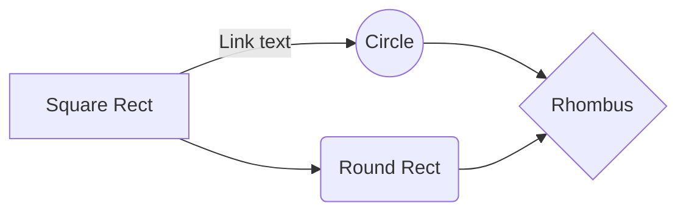

# Welcome to Lara Inventory
### Laravel based PHP Inventory Management System


## Basic Features 
- Laravel Frameworks 5.6 LTS  
-  Bootstrap
-   Easy migration and auto generated seed
-   SEO friendly Routes
-   User roles and Permission
-   Change user roles and permission
-   Change Parent and subcategories
-   Test Demo users
-   Login
-   Test demo orders

## System Requirements
-   PHP >= 7.1.3
-   OpenSSL PHP Extension
-   PDO PHP Extension
-   Mbstring PHP Extension
-   Tokenizer PHP Extension
-   XML PHP Extension
-   Ctype PHP Extension
-   JSON PHP Extension

## Installation process 

Clone repo

```
git clone hthttps://github.com/rafayethossain/Invenotry-Management-.git

```
Install Composer

```
[Download Composer](https://getcomposer.org/download/)

```

composer update/install

```
composer install


Database

```
 -   `create database with name inventory`

```

Create .env file and set
```
 -   `DB_DATABASE=inventory`
 -   `DB_USERNAME=root`
 -   `leave password blank`

Or
```
 -   `Rename - Copy.env to .env`


```
Now Write in command prompt 

-   `$ php artisan migrate`
-   `$ php artisan db:seed`
-   `$ php artisan serve`


```
Access on the web page
-  ` https://127.0.0.1:8000`

```
Login Credentials 
- Email: tom@mail.com 
- Password: secret


```

And this will produce a flow chart:


